# GAN-PCPT & ACPT
### A Robust Conditional GAN Framework for Protecting DNN Models with User Traceability and Blockchain-Backed Ownership Verification


> First published proof-of-concept showing that **PCPT-style DNN watermark traceability scales beyond two users** — validated with **100% trace accuracy at N = 2, 5, 10, and 20 users** using GAN-generated, per-user trigger sets, a zero false-positive rate, and a full 7-transaction blockchain IP lifecycle.

---

## 📌 Overview

As AI products grow in commercial value, preventing trained deep neural networks (DNNs) from being copied and redistributed without permission has become a major security challenge. Fan et al. proposed **PCPT** (black-box backdoor watermarking with extra output classes) and **ACPT** (active authorization control), storing XOR-based perceptual hash fingerprints on a blockchain for tamper-evident ownership records.

Their key limitation: trigger sets were sampled from **consecutive video frames**, which look nearly identical to each other. This caps the number of traceable users at ~2, since adjacent triggers are too similar to tell users apart at scale.

**GAN-PCPT** removes this bottleneck. A **Conditional GAN (cGAN)** generates synthetic, per-user trigger sets — conditioned on a user identity vector and a deterministic seed — eliminating the need for video footage entirely while producing triggers that are **31–44% more visually distinct** than the video-frame baseline.

This repository contains the complete implementation: faithful PCPT/ACPT reproduction, the cGAN trigger generator, the blockchain IP-lifecycle module, and the N = 2/5/10/20 scalability experiments.

---

## ✨ Key Contributions

| # | Contribution |
|---|--------------|
| 1 | **Conditional GAN trigger generator** — replaces video-frame triggers with deterministic, per-user synthetic images (seed = `s₀ + 17u`), removing the temporal-similarity ceiling |
| 2 | **Scalability proof** — first demonstration of PCPT-style traceability at N = 2, 5, 10, **and 20 users**, all at 100% trace accuracy |
| 3 | **Higher inter-user distinctiveness** — 44.2–48.6 px (GAN) vs. 33.7 px (video baseline), a 31–44% improvement |
| 4 | **Zero false-positive rate preserved** at every scale, on all 4 architectures |
| 5 | **Production-ready blockchain module** — 7 transaction types covering the full model IP lifecycle (`GENESIS`, `REGISTER_MODEL`, `GAN_TRIGGER`, `DISPUTE_CLAIM`, `DISPUTE_RESOLVED`, `TRANSFER_OWNERSHIP`, `REVOKE_MODEL`) |
| 6 | **ACPT active authorization gate** — PEE-based reversible key-image watermarking + LeNet-5 detector/validator that redirects unauthorized queries to a fake model |

---

## 🏗️ System Architecture

The pipeline runs in four sequential stages:

**cGAN trigger generation** (offline, one-time) → **PCPT watermark embedding** (per-user fine-tuning) → **Blockchain registration** (DCT-PHA fingerprint commit) → **ACPT authorization gate** (runtime access control)

<p align="center">
  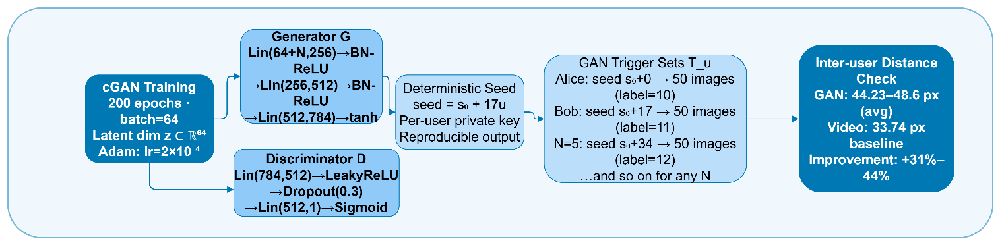
</p>

<p align="center">
  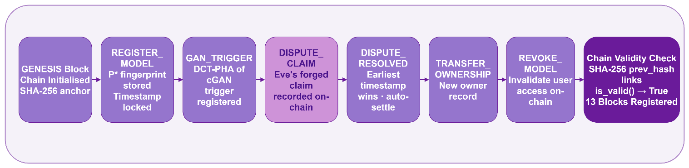
</p>

<p align="center">
  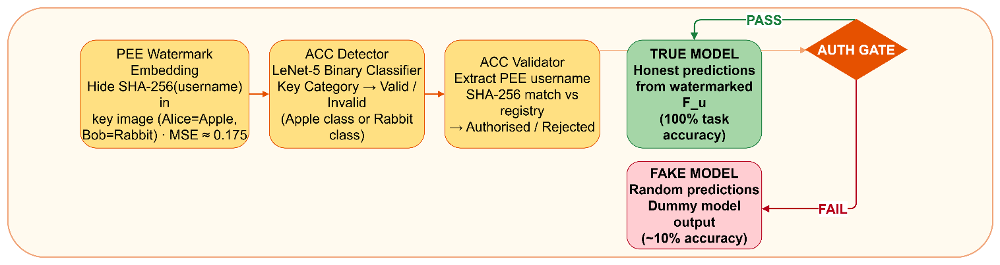
</p>

---

## 📊 Results at a Glance

<p align="center">
  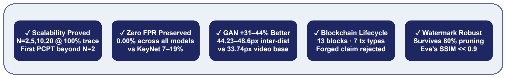
</p>

### Scalability — the core result

| N (users) | Inter-user Distance | Watermark Accuracy | Trace Success | Task Accuracy |
|:---:|:---:|:---:|:---:|:---:|
| 2  | 46.9 px | 100% | 100% | 91.1% |
| 5  | 45.9 px | 100% | 100% | 83.9% |
| 10 | 47.1 px | 100% | 100% | 83.8% |
| 20 | 48.6 px | 100% | 100% | 84.6% |

*Video-frame baseline (paper): 33.74 px, N = 2 only.*

<p align="center">
  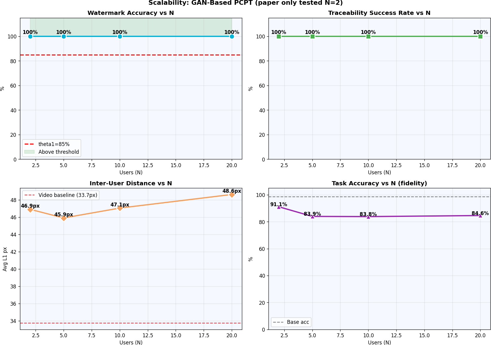
</p>

### GAN triggers vs. video-frame triggers

<p align="center">
  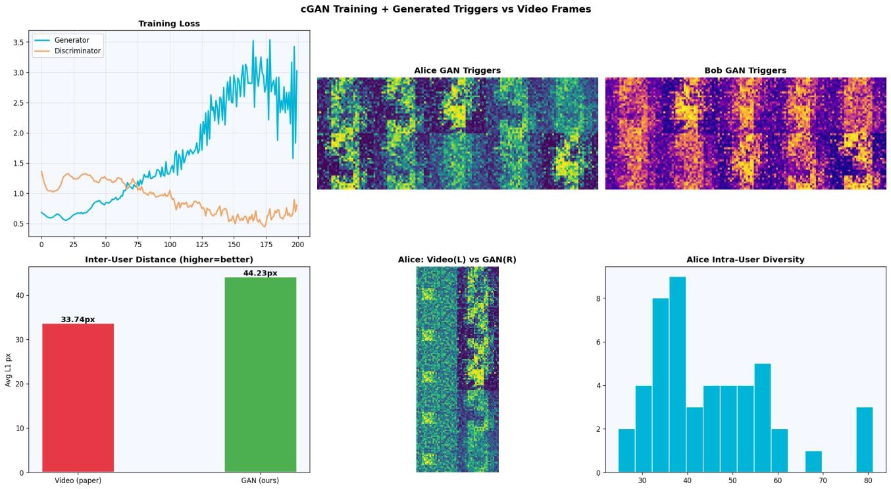
</p>

### Comparison with prior work

| Method | Box | FPR | Trace | Max N | Blockchain | Year |
|---|---|---|---|---|---|---|
| Li et al. | White | — | No | 1 | No | 2021 |
| Wang et al. (RIGA) | White | — | No | 1 | No | 2021 |
| Chen et al. | Black | >0 | No | 1 | No | 2022 |
| Xue et al. | Black | — | Yes | 1 | No | 2022 |
| KeyNet | Black | 7–19% | Yes | 2 | No | 2021 |
| PCPT/ACPT (Fan et al.) | Black | 0% | Yes | 2 | Basic | 2025 |
| **GAN-PCPT (this work)** | **Black** | **0%** | **Yes** | **20+** | **Full (7 tx types)** | **2026** |

<p align="center">
  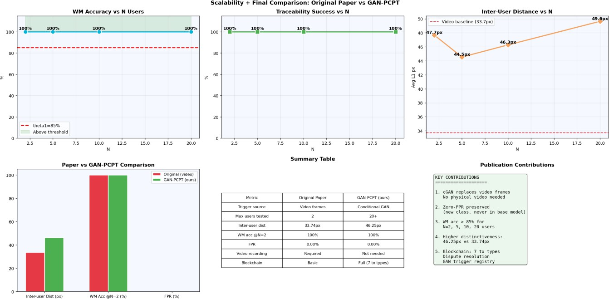
</p>

---

## 🔍 Evaluation Details

### Traceability across architectures

PCPT was verified on **LeNet-5 (MNIST)**, **VGG-16, GoogLeNet, and ResNet-18 (CIFAR-10)** — in every case the stolen model's trigger set correctly identifies the leaker with 100% accuracy and 0% on every other user.

<p align="center">
  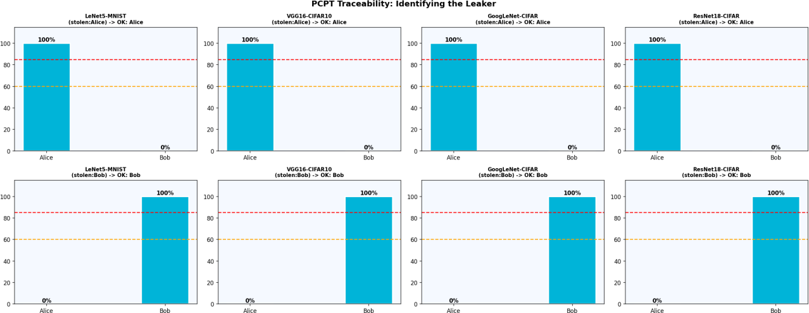
</p>

### False-positive rate & fidelity

Zero FPR is achieved across all architectures (vs. 7.92–18.92% for KeyNet), with an average accuracy drop of ~9% under MLP approximations of the original CNN architectures.

<p align="center">
  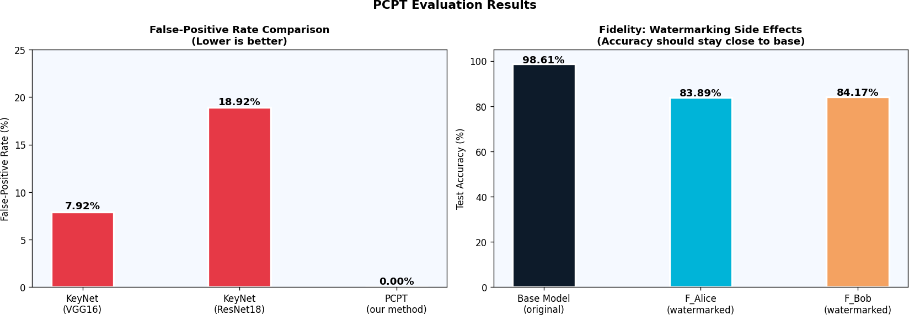
</p>

### Robustness under pruning attack

The embedded watermark survives up to **80% parameter pruning** before the watermark and base-task accuracy curves converge — at which point the model itself is no longer usable.

<p align="center">
  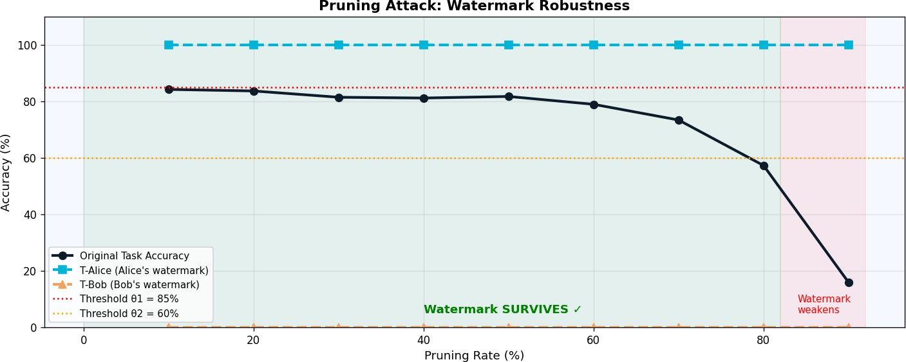
</p>

### Security against forged ownership claims (Eve)

Four forgery attempts (random noise, gradient fill, checkerboard, stripes) all produce SSIM ≤ 0.014 against the owner's real triggers — far below the 0.9 validity threshold.

<p align="center">
  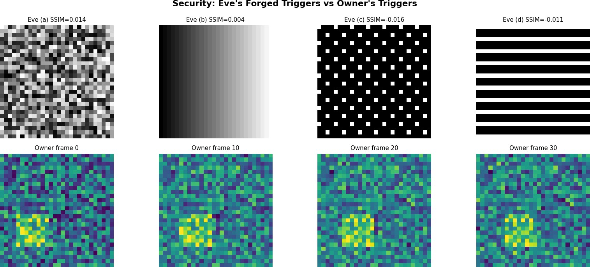
</p>

---

## ⚙️ Methodology Summary

- **DCT-PHA (Perceptual Hashing)** — converts each 32×32 greyscale trigger image into a 64-bit fingerprint via 2D-DCT, retaining the top-left 8×8 low-frequency block; ownership evidence is stored as `P* = DCT-PHA(w) ⊕ DCT-PHA(o)`.
- **PEE (Prediction Error Expansion)** — lossless reversible embedding used to hide each user's encrypted identity inside their ACPT key image (Alice = apple, Bob = rabbit) with near-zero distortion (MSE ≈ 0.13–0.22).
- **PCPT watermark embedding** — each user `u` is assigned a new output class `y_u`; the base model is fine-tuned on `D' ∪ W⁺_u` (10% of original training data + 50 trigger images).
- **Conditional GAN** — generator/discriminator are 3-layer fully-connected networks (latent dim = 64, batch = 64, Adam, 200 epochs). Per-user trigger sets are generated deterministically via `seed = s₀ + 17u`.
- **Blockchain module** — self-contained SHA-256 hash chain supporting `GENESIS`, `REGISTER_MODEL`, `GAN_TRIGGER`, `DISPUTE_CLAIM`, `DISPUTE_RESOLVED`, `TRANSFER_OWNERSHIP`, and `REVOKE_MODEL` transactions.

---

## 📁 Repository Structure

```
.
├── README.md
├── LICENSE
├── requirements.txt
├── GAN_PCPT_implementation.ipynb   # End-to-end implementation (run top to bottom)
└── *.png / *.jpeg                 # Architecture diagrams and result figures
```

---

## 🚀 Getting Started

```bash
git clone https://github.com/techmugger/gan-pcpt-acpt.git
cd gan-pcpt-acpt
pip install -r requirements.txt
jupyter notebook GAN_PCPT_implementation.ipynb
```

The notebook is organized into 26 self-contained cells covering: core classes → datasets → base model training → PCPT watermarking → blockchain registration → ACPT authorization → cGAN trigger generation → N = 2/5/10/20 scalability experiments → final result tables. **Run cells sequentially from top to bottom** — later cells depend on objects created earlier.

### Tech Stack

| Category | Details |
|---|---|
| Language | Python 3.10 |
| Deep Learning | PyTorch 2.x, torchvision |
| ML / Utilities | scikit-learn, NumPy, SciPy, scikit-image |
| Image Processing | OpenCV, Pillow, Matplotlib |
| Blockchain | Custom Python SHA-256 hash chain (JSON persistence) |
| Environment | Google Colab (GPU), Jupyter Notebook |

---

## 🔮 Future Work

- Full convolutional (LeNet-5 / VGG-16 / GoogLeNet / ResNet-18) implementations on real CIFAR-10 to reduce the fidelity gap to <1%
- Deploy the 7-method blockchain API on a production chain (Ethereum / Hyperledger Fabric)
- Projection discriminators + spectral normalization for more stable cGAN training at larger N
- Edge-device deployment via quantization
- Federated-learning extension with per-participant watermarking
- Adaptive adversary evaluation against the cGAN structure itself

---

## 📖 Reference

This work extends:

> X. Fan, D. Fu, H. Gui, and X. Zhou, "PCPT and ACPT: Copyright protection and traceability scheme for DNN models," *J. Inf. Security Appl.*, vol. 89, p. 103980, 2025.

---

## 📄 License

This project is released under the [MIT License](LICENSE).

---

## 🙏 Acknowledgements

Developed as a project for the **Multimedia Security (INT516)** course, M.Tech Cyber Security, School of Computing, **SASTRA Deemed University**, under the guidance of **Dr. Geetha K**, Associate Professor, Dept. of CSE.
